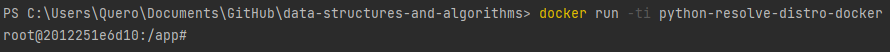
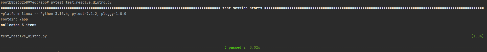

# python-mastery-4-photo-searcher

#### You can run via docker or terminal.
## RUN DOCKER:
Make sure docker is running.

## BUILD DOCKER IMAGE:
* You can change the base docker image used by changing the following lines on [Dockerfile](Dockerfile) to the version you want:
```
FROM ubuntu:latest
```

To use with docker you must first build the docker image using the following command:
* You can replace the "python_mastery" with the image name you want

```
docker build --tag python_mastery . 
```

## RUN DOCKER IMAGE:
To run the docker image use the following command:
```
docker run -ti python_mastery
```
* The '-ti' parameter
  * '-t' Allocate a pseudo-TTY
  * '-i' Keep STDIN open even if not attached




## RUN SOLUTION (Docker or Terminal):
* If you use Docker, use ```python3``` (since python3 is already installed using the Dockerfile)
* If you use Terminal, follow instructions: "HOW TO SET UP PYTHON ON YOUR TERMINAL" below and continue here.


To run the solution pass the arguments. Check the "ARGUMENTS" section.
```
python3 main.py
```

## HOW TO RUN THE TESTS:
To run the pytest execute the following command.
```
pytest test.py
```


## HOW TO EXIT
To exit docker type the following command.
```
exit
```


## =======================
## HOW TO SETUP PYTHON ON YOUR TERMINAL

### IF YOU DON'T HAVE PYTHON ON YOUR TERMINAL/PC
  * Install python using https://www.python.org/downloads/
  * Setup virtual environment: https://docs.python.org/3/library/venv.html
  * Make sure you have requirements.txt
#### [Requirements.txt](requirements.txt):

  * How to install requirements:
```
pip install -r requirements.txt
```

### If you use Terminal, check which version your system supports using the command:
  * ```python --version``` or ```python3 --version```
  * Then modify the commands you will use accordingly.


Author: [Christian Antony Quero](https://www.linkedin.com/in/christianquero/)